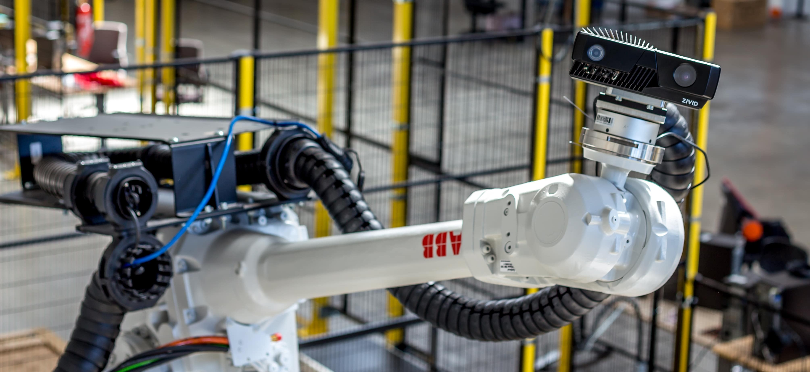
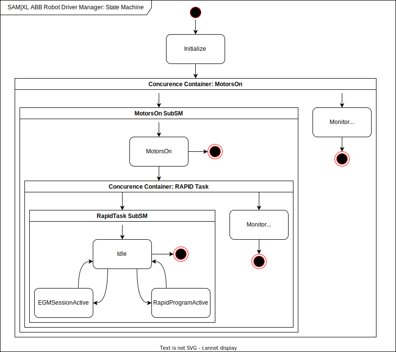

# ABB Robot Driver State Machine
  

> :warning: **Please first verify if your setup is working with the examples provided by the `abb_robot_driver` package before using this package, specifically: [`ex2_rws_and_egm_6axis_robot`](https://github.com/ros-industrial/abb_robot_driver/tree/master/abb_robot_bringup_examples#example-2-ex2_rws_and_egm_6axis_robot).**

## Overview
This package provides a state machine for use with the `abb_robot_driver` package in combination with the EGM option. The main goal of this state machine is to simplify the process of getting an ABB robot with EGM "to move" using the `abb_robot_driver`. This is achieved by a state machine implementation that manages and monitors the state of the controller, allowing developers to request a certain (motion) state instead of calling commands like "Set Motors On" and "Start RAPID" and monitoring their results. 

**Authors: D. Kroezen (SAM|XL, TU Delft),  A. Vatsyayan (SAM|XL, TU Delft)**

**Affiliation: [SAM|XL](https://www.samxl.com/), [TU Delft](https://www.tudelft.nl/)**

This package hase been developed and tested under `ROS Noetic` and `Ubuntu 20.04`.

### State Transitions
An overview of the states and state transitions can be found below.

> :bulb: **The state machine currenctly automatically transitions to the `EGMActiveState` when started. External state transition triggers have not yet been implemented.** 

The state machine will exit if it detect the motors turning off (e.g. due to a emergency stop) or if the RAPID program execution is stopped. The default behaviour resets the program pointer, stops RAPID execution and turns the motors off when exiting.

#### States
- `Initialize` State  
  Connects to the RWS and EGM services, automatically starts the transition to the `MotorsOn` state by requesting the motors to turn on. The state machine will exit if it is unable to connect to the required services or is unable to turn on the motors. 

- `MotorsOn` State  
  The motors are on. This states automatically starts the transition to `Idle` state by starting the main RAPID program. The state machine wil exit if it is unable to start the RAPID program.

- `Idle` State  
  The state machine and robot controller are ready to transition to either an EGM session or by executing a RAPID routine.

  > :bulb: Currently the `Idle` state automatically transitions to the `EGMSessionActive` state by starting an EGM session and loading the `joint_position_trajectory_controller`.

- `EGMSessionActive` State  
  The EGM session is active. This state monitors the EGM session and will transition back to the `Idle` state if the EGM session stops (e.g. due to a time-out).

- `RapidRoutineActive` State 
  > :warning: Not yet implemented  

  A RAPID routine is being executed. This state monitors the RAPID routine execution and will transition back to the `Idle` state if the routine finishes.

#### Montitor States
The monitor states ensure the robot controller state is in sync with the state machine, these states are executed in parallel to other states. 
- `MonitorMotorsOn` State  
  The motor status is constantly monitored to ensure the contoller is in the correct state. This state will trigger an exit of the state machine if the motors turn off unexpectedly, e.g. due to an emergency stop. 

- `MonitorRapidTaskRunning` State  
  The RAPID program is constantly monitored to ensure the controller is in the correct state. This state will trigger an exit of the state machin if the RAPID program is stopped unexpectedly, e.g. due to the stop button being pressed on the teach pendant. 

## Installation

### Building
To build from source, clone the lastest version from this repository into your catkin workspace:

    cd catkin_ws/src
    git clone https://github.com/sam-xl/abb_robot_driver_state_machine

Use `vcstool` to clone other project packages and complete the project workspace:

    vcs import src < ./src/abb_robot_driver_state_machine/dependencies.repos  

Install the dependencies of the cloned packages using `rosdep`:

    rosdep install --from-paths src --ignore-src -r -y

Finally, build all packages in the workspace:

    catkin build

## Usage
After starting the `abb_robot_driver`, the state machine can be launched by using the provided launch file:

    roslaunch abb_robot_driver_state_machine state_machine_bringup.launch

## Config files
The user can specify the requested EGM settings by providing a config file with the settings to either the node or the launch file. 

- `./config/egm_settings_abb_irb1200.yaml`  
  EGM settings to set the `max_speed_deviation` from the default value (configured on the IRC5 controller) to `100.0`. 

- `./config/20220812_egm_settings_dump_abb_irb1200.yaml`  
  A dump of the EGM settings of an ABB IRB1200 with an increased `max_speed_deviation`. Increase `max_speed_deviation` if you require even faster joint velocities (the value is in `deg/s`).

If no config file is proved the default EGM settings are used as specified on the IRC5 controller. The settings in the config files are only applied for the next session and are not persistent. 

## Launch files
* **`state_machine_bringup.launch`**: Launches the `abb_robot_driver_state_machine` node.  
  Arguments (for a description of the arguments, see the node description):
  - `egm_settings` (string, optional)
  - `taskname` (string, default: `T_ROB1`)  
  - `rws_namespace` (string, default: `/rws`)  
  - `egm_namespace` (string, default: `/egm`)  
  
## Nodes
This package contains a single node containing the state machine: `abb_robot_driver_state_machine`

### `state_machine_node`
Starts a state machine which will automatically transition to the `Idle` state. 

#### Parameters 

* `rws_namespace` (string, default: `/rws`)  
Namespace of the rws services and topics to be used by the state machine

* `egm_namspace` (string, default: `/egm`)  
Namespace of the egm services and topics to be used by the state machine

* `taskname` (string, default: `T_ROB1`)  
The name of the RAPID task which is running the "StateMachine Add-In"

* `egm_settings` (string, optional)  
The filename (including path) of the file containing the EGM settings to apply for each EGM session.

## Bugs & Feature Requests
Please report bugs and request features using the [Issue Tracker](https://github.com/sam-xl/abb_robot_driver_state_machine/issues).

